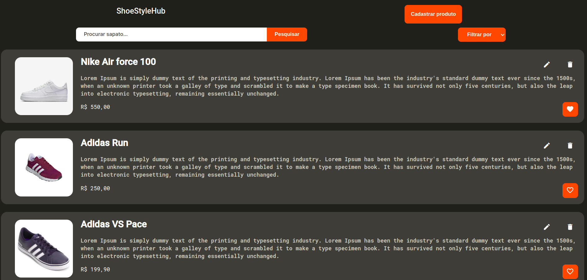

# ShoestyleHub - Gestão de Estoque de Sapatos

O ShoestyleHub é uma aplicação web desenvolvida para facilitar a gestão de estoque de sapatos. Com esta plataforma, os usuários podem realizar diversas operações, como listar, cadastrar, editar e remover sapatos do inventário. Além disso, a aplicação oferece a funcionalidade de criar listas personalizadas para favoritar sapatos e permite a aplicação de filtros para uma busca mais eficiente.

<p align="center">
  
</p>

# Funcionalidades Principais

## 1. Listar Sapatos
Os usuários podem visualizar uma lista completa de todos os sapatos disponíveis no estoque. Esta funcionalidade proporciona uma visão geral dos produtos disponíveis.

## 2. Cadastrar Sapatos
Adicione novos sapatos ao estoque de forma rápida e fácil. Insira informações detalhadas, como marca, modelo, tamanho e quantidade disponível.

## 3. Editar Sapatos
Atualize informações de sapatos existentes. Esta funcionalidade é útil para corrigir detalhes, ajustar quantidades ou fazer qualquer outra modificação necessária.

## 4. Remover Sapatos
Remova sapatos do estoque quando necessário. Mantenha o inventário sempre atualizado e evite inconsistências.

## 5. Favoritar Sapatos
Crie listas personalizadas de sapatos favoritos. Facilite o acesso aos produtos preferidos e otimize o processo de compra ou seleção.

## 6. Filtrar Sapatos
Utilize filtros para buscar sapatos de acordo com critérios específicos, como marca, tamanho ou modelo. Esta funcionalidade torna a busca mais eficiente e direcionada.

# Tecnologias Utilizadas

- Angular
- JSON Server

# Como Executar o Projeto

### 1. Clone o repositório
```
git clone https://github.com/seu-usuario/shoestylehub.git
```

### 2. Instale as Dependências:
```
cd shoestylehub
npm install
```

### 3. Inicie o JSON Server:
```
json-server --watch db.json
```

### 4. Inicie o Servidor Angular:
```
ng serve
```

### 5. Acesse a Aplicação:
Abra o navegador e acesse http://localhost:4200/ para utilizar o ShoestyleHub.

# 👨‍💻 Autor
---

<a href="https://github.com/MarceloCChaves">
 
 <br />
 <sub><b>Marcelo Chaves</b></sub></a> <a href="https://avatars.githubusercontent.com/u/62251064?s=400&u=b1c8da11d91445ccb2d97b709ccbcd0524885d98&v=4" title="Marcelo">🚀</a>


Feito com ❤️ por Marcelo Chaves 👋🏽 Entre em contato!

[](https://www.linkedin.com/in/marcelocchaves/) 
[](mailto:Marcelochaves20000@gmail.com)

